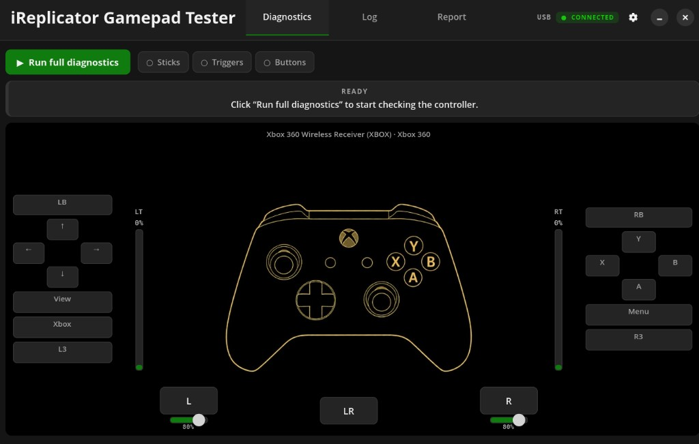

# iReplicator Gamepad Tester

[](https://github.com/iReplicatorLab/Gamepad-Tester/actions/workflows/build.yml)

**English** · [Русский](#русский)

Desktop app to test and diagnose **Xbox 360** and **Xbox Series / One** controllers on **Linux**, **Windows**, and **macOS**.

Connect a gamepad over USB or Bluetooth, run guided diagnostics, and get a report with stick drift, trigger range, button checks, and more. Interface is available in **English** and **Russian**.



## Features

- **Live monitoring** — buttons, sticks, triggers, and rumble with an Xbox controller diagram
- **Guided diagnostics** — step-by-step tests for sticks, triggers, and buttons (hold, sensitivity, stickiness)
- **Stick analysis** — drift at rest, dead zone, gate shape
- **Report** — score, issues list, export to JSON / CSV
- **Profiles** — auto-detect Xbox 360 vs Xbox One / Series axis layout
- **Cross-platform** — GTK 4 on Linux, Tkinter on Windows and macOS

## Download

Pre-built packages are attached to [GitHub Releases](https://github.com/iReplicatorLab/Gamepad-Tester/releases) (tag `v*`).

| Platform | Artifact |
|----------|----------|
| Linux x64 | `ireplicator-gamepad-tester_*_amd64.deb` |
| Linux ARM64 | `ireplicator-gamepad-tester_*_arm64.deb` |
| Windows x64 | `iReplicator Gamepad Tester.exe` (in zip) |
| Windows ARM64 | `iReplicator Gamepad Tester.exe` (in zip) |
| macOS Apple Silicon | `iReplicator Gamepad Tester.app` (in zip) |
| macOS Intel | `iReplicator Gamepad Tester.app` (in zip) |

CI builds all six targets on every release tag.

## Linux — install from .deb

```bash
sudo apt install ./ireplicator-gamepad-tester_*_amd64.deb
```

Dependencies: Python 3.10+, GTK 4, Libadwaita, python3-evdev, python3-pygame.

**Input access** (read gamepad without root):

```bash
sudo ./setup-input-access.sh
# log out and back in
```

Launch from the app menu or:

```bash
ireplicator-gamepad-tester
```

## Windows

Extract the zip from Releases and run `iReplicator Gamepad Tester.exe`. No separate Python install required (PyInstaller bundle).

## macOS

Extract the zip from Releases and open `iReplicator Gamepad Tester.app`.

On first launch, macOS may block the unsigned app: **System Settings → Privacy & Security → Open Anyway**.

## Run from source

**Linux**

```bash
sudo apt install python3-gi gir1.2-gtk-4.0 gir1.2-adw-1 python3-evdev python3-pygame
./run.sh
```

**Windows / macOS**

```powershell
python -m pip install -r requirements.txt pygame
python gamepad_tester_windows.py
```

## Build locally

```bash
# Linux .deb (amd64 + arm64 metadata)
./build/build-all.sh

# Windows (on Windows)
powershell -ExecutionPolicy Bypass -File build\windows\build.ps1 -Arch x64
powershell -ExecutionPolicy Bypass -File build\windows\build.ps1 -Arch arm64

# macOS (on macOS)
chmod +x build/macos/build.sh
./build/macos/build.sh arm64
./build/macos/build.sh x64
```

Push a version tag to build everything in GitHub Actions:

```bash
git tag v0.2.0
git push origin v0.2.0
```

## Project layout

| Path | Description |
|------|-------------|
| `gamepad_tester.py` | Linux entry (GTK 4) |
| `gamepad_tester_windows.py` | Windows entry (Tkinter) |
| `core/` | Diagnostics logic, config, i18n |
| `backend/` | Linux (evdev) / Windows (pygame) input |
| `ui/linux/`, `ui/windows/` | Platform UI |
| `locale/` | English / Russian strings |
| `build/` | Packaging scripts |

## License

AGPL-3.0 — see [LICENSE](LICENSE).

## Links

- GitHub: [iReplicatorLab/Gamepad-Tester](https://github.com/iReplicatorLab/Gamepad-Tester)
- Site: [ireplicator.com](https://ireplicator.com/)

---

## Русский

Десктопное приложение для **тестирования и диагностики** геймпадов **Xbox 360** и **Xbox Series / One** на **Linux**, **Windows** и **macOS**.

Подключите контроллер по USB или Bluetooth, пройдите пошаговую диагностику и получите отчёт: дрифт стиков, ход триггеров, проверка кнопок и другое. Интерфейс на **русском** и **английском**.


## Возможности

- **Мониторинг в реальном времени** — кнопки, стики, триггеры, вибрация и схема геймпада
- **Пошаговая диагностика** — стики, триггеры, кнопки (удержание, чувствительность, залипание)
- **Анализ стиков** — дрифт в покое, мёртвая зона, форма зоны
- **Отчёт** — оценка, список проблем, экспорт JSON / CSV
- **Профили** — автоматическое определение раскладки Xbox 360 и Xbox One / Series
- **Кроссплатформенность** — GTK 4 на Linux, Tkinter на Windows и macOS

## Скачать

Готовые сборки — в [релизах на GitHub](https://github.com/iReplicatorLab/Gamepad-Tester/releases) (тег `v*`).

| Платформа | Файл |
|-----------|------|
| Linux x64 | `ireplicator-gamepad-tester_*_amd64.deb` |
| Linux ARM64 | `ireplicator-gamepad-tester_*_arm64.deb` |
| Windows x64 | `iReplicator Gamepad Tester.exe` (в zip) |
| Windows ARM64 | `iReplicator Gamepad Tester.exe` (в zip) |
| macOS Apple Silicon | `iReplicator Gamepad Tester.app` (в zip) |
| macOS Intel | `iReplicator Gamepad Tester.app` (в zip) |

При пуше тега CI собирает все шесть платформ.

## Linux — установка из .deb

```bash
sudo apt install ./ireplicator-gamepad-tester_*_amd64.deb
```

Зависимости: Python 3.10+, GTK 4, Libadwaita, python3-evdev, python3-pygame.

**Доступ к вводу** (чтение геймпада без root):

```bash
sudo ./setup-input-access.sh
# перезайдите в систему
```

Запуск из меню приложений или:

```bash
ireplicator-gamepad-tester
```

## Windows

Распакуйте zip из релиза и запустите `iReplicator Gamepad Tester.exe`. Отдельная установка Python не нужна (сборка PyInstaller).

## macOS

Распакуйте zip из релиза и откройте `iReplicator Gamepad Tester.app`.

При первом запуске macOS может заблокировать неподписанное приложение: **Системные настройки → Конфиденциальность и безопасность → Всё равно открыть**.

## Запуск из исходников

**Linux**

```bash
sudo apt install python3-gi gir1.2-gtk-4.0 gir1.2-adw-1 python3-evdev python3-pygame
./run.sh
```

**Windows / macOS**

```powershell
python -m pip install -r requirements.txt pygame
python gamepad_tester_windows.py
```

## Локальная сборка

```bash
# Linux .deb (amd64 + arm64)
./build/build-all.sh

# Windows (на Windows)
powershell -ExecutionPolicy Bypass -File build\windows\build.ps1 -Arch x64
powershell -ExecutionPolicy Bypass -File build\windows\build.ps1 -Arch arm64

# macOS (на macOS)
chmod +x build/macos/build.sh
./build/macos/build.sh arm64
./build/macos/build.sh x64
```

Сборка в GitHub Actions по тегу:

```bash
git tag v0.2.0
git push origin v0.2.0
```

## Лицензия

AGPL-3.0 — см. [LICENSE](LICENSE).

## Ссылки

- GitHub: [iReplicatorLab/Gamepad-Tester](https://github.com/iReplicatorLab/Gamepad-Tester)
- Сайт: [ireplicator.com](https://ireplicator.com/)
